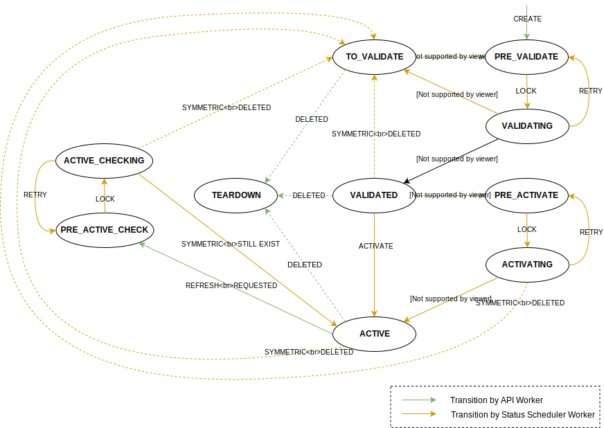
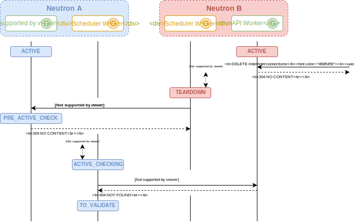

=======================
Lifecycle state machine
=======================

The lifecycle state machine is used to correctly handle the lifecycle of an
interconnection resource and allow to interact with the other Neutron instances
in background, asynchronously from Neutron API calls.

State machine overview
----------------------

Based on `Neutron specification <https://specs.openstack.org/openstack/neutron-specs/specs/rocky/neutron-inter.html>`_,
intermediate states, acting as lock, have been introduced to handle concurrency
between Neutron API call processing and background task on a given
interconnection.

Furthermore, the state machine has to be able to handle cases where the others
Neutron instances are not available. Periodic retries will be done by the
background task.

An overview of the state machine is given in the following diagram:

TO_VALIDATE
  interconnection resource has been created, but the existence of the
  symmetric interconnection hasn't been validated yet.

PRE_VALIDATE
  interconnection resource has been created and has to be locked before
  validating the existence of the symmetric interconnection.

VALIDATING
  interconnection resource has been locked, validating the existence of
  the symmetric interconnection.

VALIDATED
  the existence of the symmetric interconnection has been validated and local
  interconnection parameters have been allocated (remote parameters are
  still unknown in some cases).

PRE_ACTIVATE
  interconnection resource has to be locked before setting remote parameters.

ACTIVATING
  interconnection resource has been locked, retrieving the local parameters of
  the symmetric interconnection to be set in remote parameters.

ACTIVE
  both local and remote parameters are known, interconnection has been setup on
  this side.

PRE_ACTIVE_CHECK
  interconnection resource has to be locked before checking that the symmetric
  interconnection still exists.

ACTIVE_CHECKING
  interconnection resource has been locked, checking that the symmetric
  interconnection still exists.

TEARDOWN
  interconnection resource has been deleted, refreshing symmetric
  interconnection to synchronize its state.

Workflows
---------

As we can see in the following worflows, the state machine:
* Does not need to know the state of the remote state machines and 
* Does read-only actions, like GET or PUT refresh, on remote state machines,

The following diagrams summarize:
* An interconnection creation workflow.
 
.. figure:: lifecycle_fsm_create_workflow.svg

* An interconnection deleted on one side workflow.

